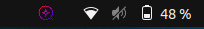

<p align="center">
  
</p>

<h3 align="center">Sunch</h3>

<p align="center">
    Providing answers to your questions using the most popular LLMS.
  <br>
  <a href="#how-to-use"><strong>Explore About Sunch »</strong></a>
  <br>
  <br>
  <a href="#">Report bug</a>
  ·
  <a href="#">Request feature</a>
</p>

## Project Summary

Sunch is an application that provides an answer to your question using the most popular LLMS such as GPT and Gemini

## Setup

To interact with LLMS, Sunch will use the APIs available for use. For this you need to provide your api-key. create environment variables with the value of your api-key

| LLM           | status       | variable             
| --------------| -------------|---------------------
| Gemini        | suppored     | SUNCH_GEMINI_API_KEY
| GPT           | come soom    | SUNCH_GPT_API_KEY

> Note: the variable in **Linux** needs to be in **/etc/environment** to work

After creating the variables, **restart the system**

## Instalation

The table below lists the supported platforms:

| Platform      | Build         | Status |
| --------------| ------------- |--------
| Windows       | [Download](#) | unstable
| macOS         | [Download](#) | not tested
| Linux(.deb)   | [Download](#) | unstable

> NOTE: the **Linux** build needs a post-installation script for the application to have access to all its functionalities
> ```bash
>curl -fsSL https://raw.githubusercontent.com/erickmaria/sunch/main/scripts/electron/postinstall.sh | bash
>```

## How to Use

Sunch is an application that runs in the background with an indicator in the system tray telling you that it is running.



To open the search window, use the following keyboard shortcut:

- Window and Linux: **Ctrl+Alt+P**
- Mac: **Command+Alt+P**

Then the following screen will appear.


## Contribution

Contributions are welcome! To learn more about how to contribute to the project, please refer to the CONTRIBUTING.md file.

## License

This project is licensed under the Apache License, Version 2.0 (the "License"); See the [LICENSE](LICENSE) file for more details.
